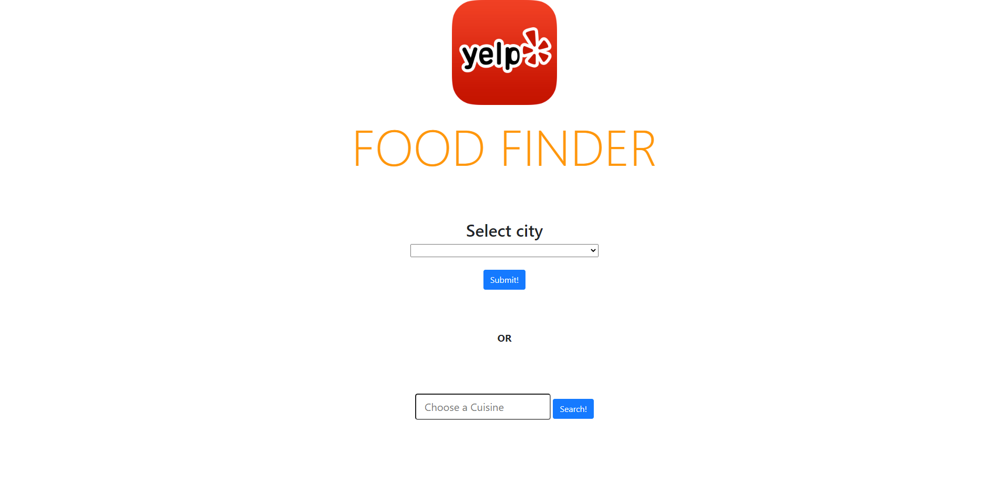
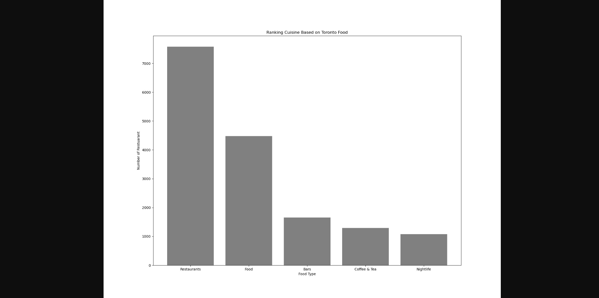
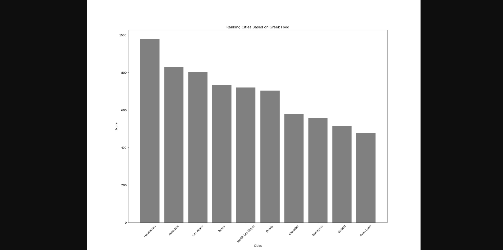

# Food Finder
LevelUp Hackathon September 2019

Project by Apu Islam, Henry Lo, Yeva Nguyen, Jacy Mark, Ritvik Khanna

###Project Description
A levelUp hackathon project created by CMPUT 401 F2019 group "The Fabulous Five".
The project "Food Finder" is a very simple Django project that 
performs some descriptive analysis on open source Yelp Dataset, 
and represents with some small visual content to describe the aggregated results.

###Project Demo
####Home Page

####Search by selecting a city
######Question: What categories are more frequent in Toronto?

---

####Search by typing a Cuisine
######Question: In which cities are Greek food more prevalent?

---

---